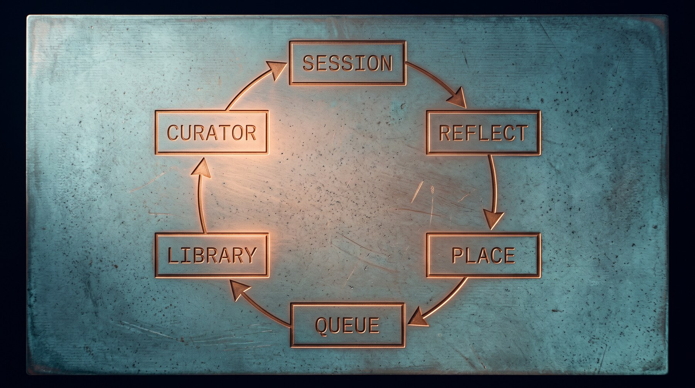
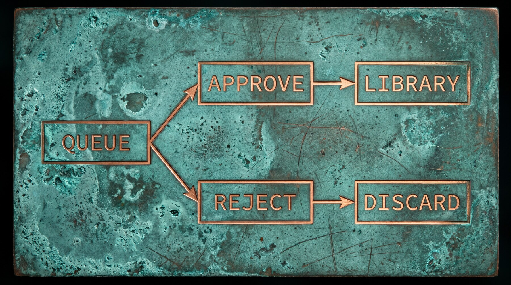

<p align="center">
  
</p>

<p align="center">
  <strong>Claude Code forgets everything when a session ends.<br>This remembers the parts worth keeping.</strong>
</p>

<p align="center">
  <a href="#español">🇪🇸 Léeme en español</a> ·
  <a href="#quick-start">Quick start</a> ·
  <a href="#how-it-works">How it works</a> ·
  <a href="#configuration">Configuration</a>
</p>

---

You tell Claude "stop formatting it like that." You explain, for the third time, that this
project runs tests with `pnpm`, not `npm`. You work out a fiddly fix for a build error at
11pm. Next session, all of it is gone.

patina is a background loop that reads your finished sessions and turns what it learned into
skills — the files Claude actually loads next time. It runs after you've closed the terminal
and never changes anything without asking you first. A session that taught something costs
around 40 cents to review at Sonnet prices; one that taught nothing stops after a cheap
first pass. `/patina:status` tells you what you've actually spent.

It's a port of [Hermes Agent](https://github.com/hermes-agent)'s self-improvement loop to
Claude Code, and it's named for the finish that builds on a surface through use — the kind
worth keeping rather than polishing off.

---

## What it actually looks like

You finish a session. A few minutes later, quietly, in the background, a small model reads
what happened and decides whether anything is worth keeping. Nothing appears in your terminal.

Next time you sit down, you check the queue:

```
$ /patina:pending

1 pending:

  NEW   reviewing-migrations-a3f9c1
        skill: reviewing-migrations  +64/-0 lines
        based on 2 lesson(s), strongest: high
```

You look at what it wants to add — and, more importantly, *why*:

```
$ /patina:approve reviewing-migrations-a3f9c1

what it says it learned:
  [correction, high] Migrations that add a NOT NULL column with a default rewrite
      the whole table on Postgres below 11, which locks it for the duration.
      evidence: "no — that one rewrites the table, we can't ship that on prod"
```

If the claim is right, you approve it and Claude knows it from then on. If it's wrong, you
reject it and it's gone. **Nothing reaches your skill library unless you say so** — until you
decide otherwise, which is what [autonomous mode](#autonomous-mode) is for.

---

## Quick start

The plugin is the easy path — it brings the commands and the hooks together, and nothing
touches your `settings.json`.

```sh
git clone https://github.com/aurelioochoa/patina
claude --plugin-dir ./patina        # try it for one session
```

Happy with it? Install it properly:

```sh
claude plugin marketplace add ./patina
claude plugin install patina@patina
```

That's it. The loop starts working at the end of your next session.

### The commands

| Command | What it does |
|---|---|
| `/patina:status` | Is the loop running? What is it costing? Is any of it being used? |
| `/patina:pending` | What it wants to change |
| `/patina:approve <id>` | Apply one — or `--all` if you're feeling brave, or `<id> --refine` to work on the draft first |
| `/patina:reject <id>` | Discard one |
| `/patina:patination` | Review the session you're in right now, without waiting for it to end |
| `/patina:curate` | Tidy the library now, instead of waiting for the weekly pass |
| `/patina:pause` | Stop the scheduled work (`resume` to start again) |
| `/patina:auto` | Let the loop approve for itself — `--dry-run` first, always |

Only you can run these. They're marked `disable-model-invocation: true`, which is deliberate
rather than tidy — they spend money and change what loads into every later session. A model
free to decide that now is a good moment for `/patina:approve --all` would defeat the whole
point of having a queue.

---

## How it works



### Two passes, and the split matters


A review is two separate forks, not one.

**Reflect** reads the session and returns a list of lessons — a claim, the evidence for it,
and how confident it is. It has no tools, no directory access, and no way to write anything
at all.

**Place** takes that list and works out where each lesson belongs in your library. It never
sees the transcript.

Two things follow. The cheap one: most sessions teach nothing, and finding that out costs one
tool-less pass instead of a full write-capable fork.

The important one: **the pass that can write files never reads attacker-controlled text.**
Your transcripts are full of web pages, file contents and command output — and a skill's
description gets injected into the system prompt of every session afterwards. Fencing a
prompt asks a model not to be fooled. This arranges for it never to be asked.

### Nothing goes live unreviewed



Neither fork can reach your real skill library. Both write into a scratch copy and aren't
even told where the real one is. Afterwards, every difference is filed for you to approve or
reject.

```sh
pending.py list                 # what the loop wants to change
pending.py show <id>            # the claims, then the checks, then the diff
pending.py refine <id>          # work on the draft before it lands
pending.py approve <id>         # apply it, and trust that skill from now on
pending.py reject <id>          # discard it
pending.py approve --all
```

`show` leads with what the change *claims to have learned* and the evidence for it, because
that's the question a diff can't answer. Then the mechanical checks: is the name valid, is
the description too long, is it written in first person, does its trigger collide with a
skill you already have. Anything that would stop the skill loading at all blocks approval —
`--force` if you really mean it.

Patches go through the queue too, not just new skills. Patching is the loop's most common
action, and one that skipped review could quietly change a skill you already trust.

A note on rejection: it removes the entry, and for a *new* skill it records a refusal that
both the use-time gate and the capture path honour. A later session that writes a skill by
that name has it dropped before it reaches the queue, and the drop is logged. Rejecting
something twice should not be a thing this asks of you.

### The queue is part of the library, as far as the loop is concerned

The writing pass works against your library *with the queue laid on top* — what it would
look like if you approved everything pending. That matters more than it sounds. A proposal
you haven't got to yet is invisible in the live library, so a fork that only saw the live
library would find nothing covering today's lesson and file another new skill; a week of
that is six overlapping git skills, none approved. Seeing the queue, it extends the
proposal instead, and the entry grows to carry both sessions' evidence rather than
splitting into rival half-answers.

### Refining a draft before it lands

What the loop files is a draft. The pass that wrote it had no user to ask, no way to test
whether the skill actually fires, and a spend ceiling — so the trigger phrase and the
wording are exactly what it couldn't settle. `pending.py refine <id>` stages an editable
copy and points you at [skill-creator](https://github.com/anthropics/skills) if you have it
installed, which is where evals and description-triggering optimisation live. Finish with
`approve <id> --from <path>`; the refined copy is re-checked before it is applied, and the
queue entry is untouched until then, so an abandoned refinement costs nothing.

**Why quarantine at all, rather than just prompting when a skill is used?** Because a skill's
name and description go into the system prompt every single session, whether or not it's ever
invoked. A bad skill sitting in your library costs context and nudges behaviour without the
`Skill` tool ever firing. Gating invocation can't fix that. Keeping it out of the library can.

### The use-time backstop

`skillgate.py` runs on the `Skill` tool and refuses auto-created skills you haven't blessed.
Quarantine means it usually has nothing to do — it's there for the gaps quarantine misses, like
a skill approved once and later edited by hand.

| State | Behaviour |
|---|---|
| `always` | allow, never ask again |
| `never` | deny, never ask again |
| session | allow for this session only |
| unset | ask |

Your hand-written skills and plugin skills are never gated. And if the gate itself breaks, it
allows — a bug in it must never lock you out of your own skills.

---

## Living with it

```sh
review.py  --status          # runs, spend, no-op rate, how much is ever used
curator.py --status          # intervals, sweep backlog, run count
curator.py --run             # run the curator now, ignoring the interval
curator.py --curate-only     # curate without sweeping first
curator.py --sweep-only      # catch up on missed sessions, skip consolidation
curator.py --pause           # stop the loop without uninstalling
git -C ~/.claude/skills log  # everything it has ever written
```

Two numbers are worth watching. If **every review is a no-op**, the prompt isn't reaching the
model — that's a broken loop wearing the costume of a quiet one. If skills are **written but
never loaded**, the loop is working and the library still isn't: an unused skill is almost
always a description that never matched anything, rather than a body that was wrong.

### Handing a skill over

The loop only writes to skills carrying the marker, so you decide what it may touch:

```yaml
---
name: my-skill
description: ...
metadata:
  autoManaged: true
---
```

Remove the marker to take it back.

---

## Installing as scripts instead

If you'd rather not use the plugin, `install.sh` puts the scripts in `~/.claude/patina` and
wires the hooks into your `settings.json` by hand.

```sh
./install.sh                  # copy scripts, init the audit repo
```

This does **not** activate anything, on purpose. A broken `SessionStart` hook fires on every
session, and you'd be debugging it inside the tool it's breaking. Check it by hand first:

```sh
# 1. Dry run — builds the prompts, forks nothing
python3 ~/.claude/patina/review.py \
    --transcript ~/.claude/projects/<slug>/<session>.jsonl --dry-run

# 2. Rehearsal: real auth, redirected writes, live library untouchable
export PATINA_SKILLS_DIR=/tmp/rehearsal/skills
export PATINA_STATE_DIR=/tmp/rehearsal/state
export PATINA_PROJECTS_DIR=/tmp/rehearsal/projects   # see the warning below
python3 ~/.claude/patina/review.py --transcript <transcript>
python3 ~/.claude/patina/pending.py list
git -C /tmp/rehearsal/skills log -p

# 3. Only once that looks right
./install.sh --register-hooks
```

⚠️ **Redirect `PATINA_PROJECTS_DIR` too**, or point it somewhere empty. It's where the sweep
looks for unreviewed sessions, and it defaults to your real `~/.claude/projects` even when
everything else is redirected — so `curator.py --run` during a rehearsal will find your
genuine backlog and fork a batch of real reviews before it ever reaches the curator. Use
`curator.py --curate-only` when the curator is what you meant to test.

`./install.sh --uninstall` removes the scripts and the hooks, and leaves your skills and their
git history alone.

⚠️ **Don't do both.** The plugin ships the same three hooks, so registering them in
`settings.json` as well fires each one twice per session. The loop survives it — the review
lock defers the duplicate — but the sweep can then start twice as many forks, and a doubled
spend ceiling isn't a ceiling. `--register-hooks` detects an installed plugin and refuses; a
plugin loaded with `--plugin-dir` leaves no trace on disk, so that case is on you.

---

## Configuration

| Variable | Default | Purpose |
|---|---|---|
| `PATINA_MODEL` | `sonnet` | model for both review and curator |
| `PATINA_TIMEOUT` | `600` | per-review timeout, seconds |
| `PATINA_CURATOR_TIMEOUT` | `900` | curator timeout, seconds |
| `PATINA_SKILLS_DIR` | `~/.claude/skills` | redirect writes (rehearsal) |
| `PATINA_STATE_DIR` | `~/.claude/patina` | redirect state |
| `PATINA_PROJECTS_DIR` | `~/.claude/projects` | redirect transcript discovery |
| `PATINA_WORK_DIR` | `~/.cache/patina` | scratch tree handed to the fork |
| `PATINA_MAX_USD` | `0.50` | shared spend ceiling per fork |
| `PATINA_COMPACT_MAX_USD` | `0.25` | ceiling for the compaction pass |
| `PATINA_REFLECT_MAX_USD` | `PATINA_MAX_USD` | ceiling for the reading pass |
| `PATINA_PLACE_MAX_USD` | `0.75` | ceiling for the writing pass |
| `PATINA_CURATOR_MAX_USD` | `PATINA_MAX_USD` | ceiling for the curator |
| `PATINA_COMPACT_MODEL` | `haiku` | model that condenses an oversized digest |
| `PATINA_AUTONOMOUS` | `false` | approve without asking (see below) |
| `PATINA_FALLBACK_MODEL` | unset | model to fall back to when the primary is unavailable |

The pre-rename `CLAUDE_SELF_IMPROVE_*` spellings still work as a fallback, so an old export in
a shell profile won't silently stop being read.

Intervals live in `state.json`:

| Key | Default | Purpose |
|---|---|---|
| `interval_hours` | `168` | how often the curator consolidates the library |
| `sweep_interval_hours` | `24` | how often the sweep picks up missed sessions |
| `sweep_limit` | `10` | forks per sweep — a spend ceiling as much as a batch size |
| `min_tool_calls` | `8` | below this *and* `min_user_turns`, a session isn't reviewed |
| `min_user_turns` | `5` | either signal alone is enough to earn a review |
| `autonomous` | `false` | approve without asking |
| `auto_min_lessons` | `2` | evidence a proposal needs to auto-approve |
| `auto_max_patch_lines` | `120` | above this a patch is a rewrite, and waits |
| `auto_trial_days` | `14` | how long an auto-approved skill has to get used |

---

## Autonomous mode

The queue has one failure mode, and it is the common one: you never read it. Twelve days of
running this produced 46 proposals, $35 of reviews, and zero approvals — which is the same
money as never running it at all, and none of the benefit.

So the queue can be replaced by a policy:

```sh
$ /patina:auto --dry-run

31 would approve, 16 held.

  PASS  safe-irreversible-git-github-ops-a064dedb
  ...
  HOLD  vendoring-third-party-web-builds-merged-2
        you rejected this skill name before
  HOLD  css-animation-techniques-4a5064b4
        strongest claim is medium, not high
  HOLD  building-claude-code-plugins-a8545518
        malformed: name contains the reserved word 'claude'
```

Read the held column before the passed one. It is where you find out whether the policy
agrees with you.

**What lands on its own.** All of these, or it waits:

- No blocking lint findings. `--force` exists for you and is unreachable from the policy.
- No name you have rejected before. That verdict outranks everything here, permanently.
- At least `auto_min_lessons` claims behind it, strongest rated `high`. One lesson is an
  anecdote.
- A patch under `auto_max_patch_lines` changed lines. Bigger than that is a rewrite.
- An archival only when nothing has ever loaded the skill. Retiring something you use is a
  surprise, not maintenance.

**What you get instead of the queue.** The promise changes, and it is worth reading as a
whole rather than taking on trust:

> Nothing reaches your library unless it passes a policy you set. Everything that lands is
> one git commit you can revert. Anything that lands and goes unused is retired
> automatically. And the first time an auto-approved skill actually runs, you are asked.

Each clause is a mechanism, not a reassurance:

- **One git commit.** `~/.claude/skills` is a git repository and every write is a commit
  naming the skill, the kind of change, and the sessions behind it. `git revert` is the undo.
- **Retired automatically.** An auto-approved skill is on trial for `auto_trial_days`. If
  nothing loads it in that window, the curator archives it — contents and history intact.
  This is the half that matters: a skill's *description* enters the system prompt of every
  later session whether or not it is ever invoked, so a library that only grows is a tax that
  only grows.
- **You are asked.** An auto-approval records the verdict `auto`, not `always`. The
  `PreToolUse` gate treats `auto` as *ask once per session*, so the first time anything tries
  to use a skill no person has read, you see it — at the moment it is about to do work,
  rather than as one diff among 46.

**When it runs.** On every scheduled background pass — the daily sweep and the weekly curate,
both already detached from your session — and at the end of any session that produced a
proposal. Over the whole queue each time, not only what that pass happened to file. A queue
only you can drain is the failure this exists to remove, so turning it on decides your
backlog too. Read the dry run first if you have one.

`/patina:auto --dry-run` is still there for when you want the answer now instead of at the
next pass, and `patina pending auto` applies it immediately.

Off by default. No version of this has ever written to a real library, and the first one to
do so should be switched on by someone who decided to.

---

## Under the hood

- A `SessionEnd` hook forks a detached, headless `claude -p` that reads a bounded digest of the
  transcript and decides whether anything is worth keeping. Sessions too small to have taught
  anything aren't forked at all — the prompt pushes hard to find a lesson, and aimed at a
  three-message session that pressure just manufactures one.
- Every session, reviewed or not, records which skills it loaded. That count is the only
  feedback the loop has: it decides what the curator treats as stale, and it's the difference
  `--status` reports between skills written and skills used.
- A `SessionStart` hook checks two intervals and forks whatever is due. No daemon. Daily, a
  sweep catches sessions whose `SessionEnd` hook never fired — a hard kill, a closed terminal,
  a crash. Weekly, a curator pass consolidates overlapping skills and archives stale ones.
- A review that fails is left unwatermarked so the sweep retries it, up to three attempts. The
  first failure in the wild was an account limit, which is transient by definition; treating
  that as reviewed would lose the session permanently.
- Writes are confined to skills marked `metadata.autoManaged: true`, enforced both in the
  prompt and by a post-run check that reverts anything outside the allowlist.
- Every fork carries a hard dollar ceiling, and a run that hits it is logged as exactly that
  rather than as a crash — retrying can't fix a limit that's simply too low.
- Every write is a git commit in a local audit repo, plus a line in an append-only log.

## Design notes

Two things carried over from Hermes, because they're what separates a useful skill library
from a junk drawer:

**The preference order.** Patch a loaded skill → patch an existing umbrella → add a
`references/` file → only then create a new skill. Without it you get a flat list of
one-session-one-skill entries.

**The "Do NOT capture" list.** Environment-dependent failures, negative claims about tools,
transient errors and unresolved failures are all explicitly excluded. This is what stops
"browser tools do not work" from hardening into a permanent self-inflicted constraint the
agent cites against itself months after the problem was fixed.

And three added since, each answering a failure the original design left open:

**Reflect and place are separate forks.** Splitting evaluation from curation is
[ACE](https://arxiv.org/abs/2510.04618)'s measured result; here it also buys the injection
boundary described above, plus an early exit on the common case.

**The curator can act.** Archiving and consolidation both need to move or remove files, which
a capture pass that only walked the proposed tree couldn't see. Both of the curator's headline
actions used to be silent no-ops.

**Usage is measured.** Age alone can't tell a skill nobody needs from one that quietly does
its job every month. The curator now sees load counts, and a skill used recently is never
stale.

Full detail in [the original design](docs/superpowers/specs/2026-08-07-claude-self-improvement-loop-design.md)
and [the 2026-08-10 amendment](docs/superpowers/specs/2026-08-10-two-pass-review-and-measured-library.md).

## Images

Every image here was generated with Higgsfield. The prompts, the reasoning behind each one,
and the notes on regenerating them are in
[`assets/image-prompts.md`](assets/image-prompts.md).

---

## Español

**Claude Code olvida todo al terminar una sesión. Esto recuerda lo que vale la pena.**

Le dices a Claude "deja de darle ese formato". Le explicas, por tercera vez, que este proyecto
usa `pnpm` y no `npm`. Resuelves a las 11 de la noche un error de build que costó trabajo
entender. En la siguiente sesión, nada de eso existe.

patina es un proceso en segundo plano que lee tus sesiones terminadas y convierte lo aprendido
en *skills*: los archivos que Claude sí carga la próxima vez. Corre después de que cerraste la
terminal y **nunca cambia nada sin preguntarte antes**. Revisar una sesión que sí enseñó algo
cuesta alrededor de 40 centavos con Sonnet; una que no enseñó nada se detiene en la primera
pasada, que es barata. `/patina:status` te dice cuánto llevas gastado.

### Cómo funciona

Cada revisión son dos procesos separados, y esa separación es el punto:

- **Reflect** lee la sesión y devuelve una lista de lecciones: una afirmación, la evidencia
  que la respalda y qué tan seguro está. No tiene herramientas ni acceso a directorios: no
  puede escribir nada.
- **Place** toma esa lista y decide dónde va cada lección en tu biblioteca. Nunca ve la
  transcripción.

De ahí salen dos cosas. La barata: la mayoría de las sesiones no enseñan nada, y descubrirlo
cuesta una sola pasada sin herramientas.

La importante: **el proceso que puede escribir archivos nunca lee texto que un atacante
podría controlar.** Tus transcripciones están llenas de páginas web, contenido de archivos y
salida de comandos, y la descripción de un skill entra al prompt del sistema en todas las
sesiones siguientes. Blindar un prompt es pedirle al modelo que no se deje engañar; esto hace
que nunca se le pregunte.

### Nada se aplica sin tu revisión

Ninguno de los dos procesos alcanza tu biblioteca real. Ambos escriben en una copia temporal y
ni siquiera saben dónde está la verdadera. Después, cada diferencia queda en una cola para que
tú la apruebes o la rechaces.

`show` empieza por lo que el cambio **dice haber aprendido** y su evidencia, porque esa es la
pregunta que un diff no puede responder. Luego vienen las verificaciones mecánicas: si el
nombre es válido, si la descripción es demasiado larga, si está escrita en primera persona, si
su disparador choca con un skill que ya tienes. Cualquier problema que impediría que el skill
cargue bloquea la aprobación.

Eso mientras el modo autónomo esté apagado, que es como viene. Encendido, la cola la lee una
política en tu lugar — ver [Modo autónomo](#modo-autónomo).

**¿Por qué una cola, en vez de solo preguntar al usarlo?** Porque el nombre y la descripción
de un skill entran al prompt del sistema en cada sesión, se invoque o no. Un mal skill guardado
en tu biblioteca consume contexto y sesga el comportamiento sin que la herramienta `Skill` se
active nunca. Controlar la invocación no arregla eso; mantenerlo fuera de la biblioteca sí.

Rechazar una propuesta nueva también registra la negativa, y desde entonces la captura la
respeta: si una sesión posterior vuelve a escribir un skill con ese nombre, se descarta antes
de llegar a la cola. Rechazar dos veces lo mismo no debería ser tu trabajo.

### La cola es parte de la biblioteca, para el proceso

El paso que escribe trabaja sobre tu biblioteca **con la cola encima**: cómo se vería si
aprobaras todo lo pendiente. Importa más de lo que parece. Una propuesta que todavía no
revisaste es invisible en la biblioteca real, así que un proceso que solo viera esa
biblioteca no encontraría nada que cubra la lección de hoy y crearía otro skill nuevo — una
semana así son seis skills de git superpuestos, ninguno aprobado. Viendo la cola, extiende la
propuesta que ya existe, y esa entrada acumula la evidencia de las dos sesiones en vez de
partirse en dos respuestas a medias.

### Pulir un borrador antes de aplicarlo

Lo que la cola guarda es un borrador. El proceso que lo escribió no tenía a quién preguntar,
ni forma de probar si el skill realmente se dispara, ni presupuesto de sobra: justo lo que no
pudo resolver es la frase disparadora y la redacción. `pending.py refine <id>` prepara una
copia editable y te apunta a [skill-creator](https://github.com/anthropics/skills) si lo
tienes instalado, que es donde viven las *evals* y la optimización del disparador. Terminas
con `approve <id> --from <ruta>`; la copia pulida se vuelve a verificar antes de aplicarse, y
la entrada de la cola queda intacta hasta ese momento, así que abandonar el pulido no cuesta
nada.

### Instalación

```sh
git clone https://github.com/aurelioochoa/patina
claude --plugin-dir ./patina        # pruébalo por una sesión
```

Si te convence, instálalo de forma permanente:

```sh
claude plugin marketplace add ./patina
claude plugin install patina@patina
```

Listo. El proceso empieza a trabajar al final de tu siguiente sesión.

### Comandos

| Comando | Qué hace |
|---|---|
| `/patina:status` | ¿Está corriendo? ¿Cuánto cuesta? ¿Se usa algo de lo que escribió? |
| `/patina:pending` | Qué quiere cambiar |
| `/patina:approve <id>` | Aplicar uno, `--all` para todos, o `<id> --refine` para pulir el borrador antes |
| `/patina:reject <id>` | Descartar uno |
| `/patina:patination` | Revisar la sesión en curso, sin esperar a que termine |
| `/patina:curate` | Ordenar la biblioteca ahora, sin esperar a la pasada semanal |
| `/patina:pause` | Detener el trabajo programado (`resume` para reanudar) |
| `/patina:auto` | Dejar que el proceso apruebe solo — siempre `--dry-run` primero |

Solo tú puedes ejecutarlos. Llevan `disable-model-invocation: true` a propósito: gastan dinero
y cambian lo que se carga en todas las sesiones siguientes. Un modelo con libertad para
decidir que este es buen momento para `/patina:approve --all` anularía el sentido de tener una
cola.

### Entregarle un skill

El proceso solo escribe en skills que llevan la marca, así que tú decides qué puede tocar:

```yaml
---
name: mi-skill
description: ...
metadata:
  autoManaged: true
---
```

Quita la marca para recuperarlo.

### Modo autónomo

La cola tiene un modo de fallo, y es el habitual: nunca la lees. Doce días de esto produjeron
46 propuestas, $35 en revisiones y cero aprobaciones — el mismo dinero que no haberlo
ejecutado nunca, y ninguno de los beneficios.

Así que la cola se puede reemplazar por una política. `/patina:auto --dry-run` no aplica nada
y te dice qué tomaría y qué retendría, con el motivo de cada retención. Lee primero la columna
de retenidos: ahí es donde descubres si la política piensa como tú.

**Qué entra solo.** Todo esto, o espera: sin hallazgos bloqueantes del lint (`--force` existe
para ti y la política no puede alcanzarlo); ningún nombre que ya hayas rechazado — ese veredicto
manda sobre todo lo demás, para siempre; al menos `auto_min_lessons` afirmaciones detrás, la
más fuerte en `high`; un parche por debajo de `auto_max_patch_lines` líneas; y un archivado
solo cuando nada ha cargado nunca ese skill.

**Qué recibes en lugar de la cola:**

> Nada llega a tu biblioteca sin pasar una política que tú defines. Todo lo que entra es un
> commit de git que puedes revertir. Lo que entra y nadie usa se retira solo. Y la primera vez
> que un skill aprobado automáticamente se ejecute, se te pregunta.

Cada cláusula es un mecanismo, no una promesa:

- **Un commit.** `~/.claude/skills` es un repositorio git y cada escritura es un commit con el
  skill, el tipo de cambio y las sesiones detrás. `git revert` es el deshacer.
- **Se retira solo.** Un skill aprobado por la política queda a prueba `auto_trial_days` días.
  Si nada lo carga en esa ventana, el curador lo archiva — con su contenido y su historia
  intactos. Esta es la mitad que importa: la *descripción* de un skill entra al prompt del
  sistema de todas las sesiones siguientes se invoque o no, así que una biblioteca que solo
  crece es un impuesto que solo crece.
- **Se te pregunta.** Una aprobación automática registra el veredicto `auto`, no `always`. El
  gancho `PreToolUse` trata `auto` como *preguntar una vez por sesión*, así que la primera vez
  que algo intente usar un skill que ninguna persona ha leído, lo ves — en el momento en que va
  a actuar, y no como un diff entre 46.

**Cuándo corre.** En cada pasada programada en segundo plano — el barrido diario y la curación
semanal, ambos ya separados de tu sesión — y al final de cualquier sesión que haya producido
una propuesta. Sobre toda la cola cada vez, no solo sobre lo que esa pasada acaba de archivar.
Una cola que solo tú puedes vaciar es justamente el fallo que esto viene a eliminar, así que
encenderlo también decide lo que tienes acumulado. Lee el `--dry-run` primero si tienes cola.

Apagado por defecto. Ninguna versión de esto ha escrito nunca en una biblioteca real, y la
primera que lo haga debería encenderla alguien que lo decidió.

### Dos números que vale la pena vigilar

Si **todas las revisiones no hacen nada**, el prompt no está llegando al modelo: es un proceso
roto disfrazado de biblioteca tranquila. Si se **escriben skills pero nunca se cargan**, el
proceso funciona y la biblioteca no: un skill sin uso casi siempre tiene una descripción que
nunca coincidió con nada, no un contenido equivocado.

La configuración completa, las variables de entorno y los detalles internos están en las
secciones en inglés de arriba.

---

## License

MIT
